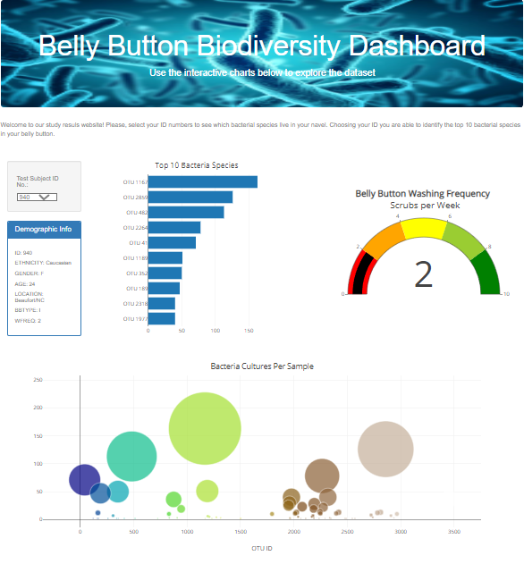

# Plotly-Belly-Button-Biodiversity

Roza is a biological researcher in a prominent microbiology laboratory. Many bacterial species are not well studied 
and many more remain unknown to science. Roza's role is to discover and document these bacteria. In particula Roza
is interested in bacterial species that have ability to synthesize proteins that taste like beef. Her lab has partnered
with Improbable Beef, a food startup to research candidate species. Labs across the country have had success in synthesizing meat 
from algae, fungi, and microorganesms found on plant roots. However, Improbable Beef is still searching for the elusive bacteria
that will provide the perfect taste. Roza has a hypothesis that there's a microorganism that can supply the next best taste,
and she believes it can be found quite close to home from bacteria found on the human body. Here's what Roza knows so far. The human
body is a source of thousands of types of bacteria, and different parts of the body harbor different species. Bacteria found in the gut
are not the same species that are found on a person's eyelashes for example. Furthermore, between indivifuals the bacterial species
may vary even in the same location. Roza hypothesizes that the ideal bacterial species to make synthetic beef, may be found
in the belly button, or at least in someone's belly button. To test her hypothesis, Roza has sampled the navels
of people across the country to identify bacterial species that colonize our belly buttons. Each person's identity is anonymous.
They've instead been assigned an ID number. Roza wanted to build a dashboard that both her research participants, and fellow researchers can 
access. She has a completed panel for demographic information and wanted
to visualize the bacterial data for each volunteer. This is the aim we have pursued in this project.

Those who participated in the study are able to visit a website and select their ID numbers to see which bacterial 
species live in their navels. Now her volunteers are able to identify the top 10 bacterial species in their belly buttons.
That way, if Improbable Beef identifies a species as a candidate to manufacture synthetic beef, Roza's volunteers will be able
to identify whether that species is found in their navel.
